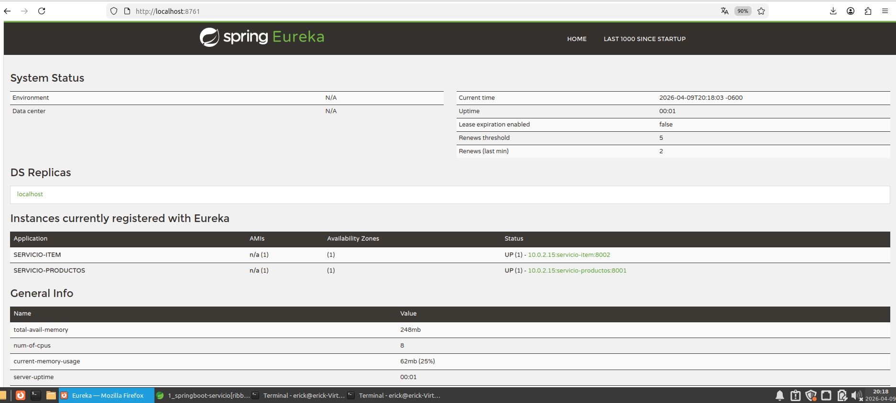
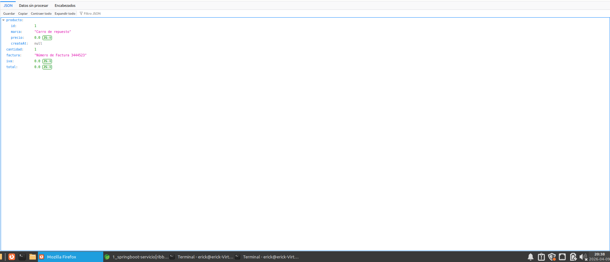

# Tarea03_ComputaciónNube

**Materia:** Seminario de Ciencias de la Computación B (Computación en la Nube) 
**Profesor:** Gustavo Márquez Flores 

## Integrantes del Equipo
* Luis Mario Solares Ramos
* Erick Luis Juarez

## Descripción del Proyecto
Este proyecto implementa una arquitectura de microservicios con Spring Boot y Spring Cloud, utilizando Eureka Server para el registro y descubrimiento de servicios, y Hystrix para tolerancia a fallos.

##Ejecucion del proyecto
### 1. Levantar el Servicio de Eureka
Ubicarse en la carpeta del servidor Eureka:

cd springboot-servicio-eureka-server

Ejecutar:

mvn spring-boot:run

Acceder en el navegador:

http://localhost:8761

### 2. Levantar el Servicio de Item y Producto
Abrir otra terminal y ubicarse en:

cd springboot-servicio-productos

Ejecutar:

mvn spring-boot:run

Disponible en:

http://localhost:8001

Abrir otra terminal y ubicarse en:

cd springboot-servicio-item

Ejecutar:

mvn spring-boot:run

Disponible en:

http://localhost:8002

Para ver que funciona vamos a http://localhost:8761 y observamos que los servicios de Item y Producto se ven registrados en el servivio de Eureka

### 3. Funcionamiento

### 3.1 Caso 1: Flujo normal

Se realiza una petición al endpoint:

http://localhost:8002/ver/1/cantidad/1

En esta respuesta:

* servicio-item consulta a servicio-productos
* Se obtiene un producto real desde la base de datos
* Se calcula el total con la cantidad

### 3.2 Caso 2: Prueba de tolerancia a fallos (Hystrix)

Se detiene el servicio servicio-productos y se vuelve a hacer la misma petición:

http://localhost:8002/ver/1/cantidad/1

y en http://localhost:8761 podemos ver que el servicio de productos aparece como downed

En este caso:

* Hystrix detecta que el servicio no está disponible
* Se ejecuta el método alternativo (fallback)
* Se devuelve un producto por defecto ("Carro de repuesto")
